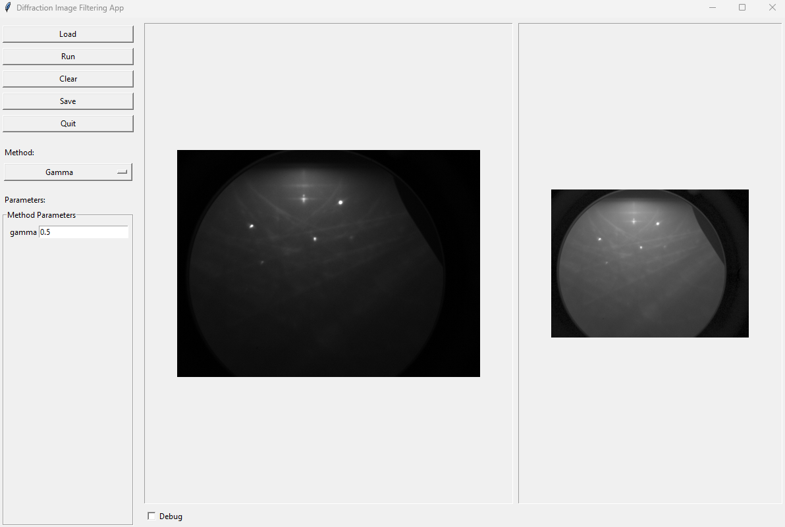

# Diffraction Image Filtering App 🩻

Dedicated to filtering diffraction images obtained with techniques such as **RHEED** or **EBSD**. Minimal desktop app to load diffraction images, convert them to HDF5, apply filtering pipelines, preview results, and save outputs.

## Prerequisites

- Python 3.10 or 3.11
- Tk available (Windows bundle it; on Linux install `python3-tk`)

## Installation
Create a virtual environment and install pinned dependencies.

```ps1
py -m venv .venv
.\.venv\Scripts\Activate.ps1
python -m pip install --upgrade pip setuptools wheel
pip install -r requirements.txt
```
## Quick start

From the project root:

    python app.py

- Click **Load** to select an image (`.png`, `.jpg`, `.tif`, `.tiff`).
- The app converts to `.h5` internally and displays the image.
- Choose a method, adjust parameters, click **Run**.
- Click **Save** to write the processed image.
- The **Debug** panel under the previews shows logs.

The application should start with the following screen (loaded RHEED image as example):
